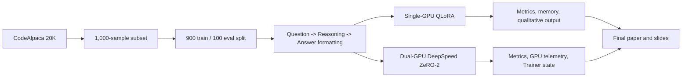

# Efficient Fine-Tuning of Code Language Models Under Hardware Constraints

This project compares two practical fine-tuning strategies for the same code-instruction task:

- **Single-GPU QLoRA** on Google Colab with one Tesla T4 GPU.
- **Dual-GPU DeepSpeed ZeRO-2** on RunPod with two NVIDIA RTX A4000 GPUs.

Both experiments use `Qwen/Qwen2.5-0.5B-Instruct` and a 1,000-example subset of `HuggingFaceH4/CodeAlpaca_20K`, split into 900 training samples and 100 evaluation samples. The goal is to show the trade-off between low-memory adapter training and faster distributed full-parameter training.

## Project At A Glance

| Track | Hardware | Method | Trainable Parameters | Epochs | Eval Loss | Best Use Case |
|---|---|---|---:|---:|---:|---|
| Single-GPU QLoRA | 1 x Tesla T4 | 4-bit quantization + LoRA adapters | 8.80M / 502.83M | 5 | 0.823 | Low-memory experimentation |
| DeepSpeed ZeRO-2 | 2 x RTX A4000 | FP16 full-parameter fine-tuning | 494.03M / 494.03M | 1 | 0.616 | Faster multi-GPU full fine-tuning |

## Repository Layout

```text
.
|-- DeepSpeed/
|   |-- train_deepspeed_zero2_fair.py   # Dual-GPU ZeRO-2 training script
|   |-- ds_zero2_config.json            # DeepSpeed ZeRO-2 runtime config
|   |-- ds_zero2_config_explained.md    # Human-readable config notes
|   |-- RUN_COMMANDS.md                 # Step-by-step execution commands
|   |-- parse_gpu_log.py                # nvidia-smi telemetry summarizer
|   |-- results/                        # Captured DeepSpeed metrics
|   |-- logs/                           # Captured terminal and GPU logs
|   `-- outputs/                        # Trainer state and tokenizer output
|-- Single_GPU_CodeAlpaca_Qwen_QLoRA_Final.ipynb
|-- Final_IEEE_Paper.pdf
|-- generate_slides.py
|-- generate_polished_slides.py
|-- output/slides/                      # Generated presentation decks/assets
`-- docs/GIT_WORKFLOW.md
```

## Experimental Flow



## Dataset Format

The dataset provides `prompt` and `completion` fields. Each sample is converted into a consistent response template:

```text
### Question:
<prompt>

### Reasoning:
Understand the programming task, identify the required inputs and outputs, select the correct logic or algorithm, and then write the final code solution.

### Answer:
<completion>
```

The reasoning field is a synthetic structure template because CodeAlpaca does not include human-written reasoning traces.

## Key Results

| Metric | Single-GPU QLoRA | Dual-GPU DeepSpeed ZeRO-2 |
|---|---:|---:|
| GPU setup | 1 x Tesla T4 | 2 x RTX A4000 |
| Fine-tuning type | 4-bit LoRA adapter tuning | Full-parameter fine-tuning |
| Train samples | 900 | 900 |
| Eval samples | 100 | 100 |
| Trainable parameters | 8,798,208 | 494,032,768 |
| Trainable percentage | 1.7497% | 100.0000% |
| Training runtime | 2,829.545 s | 247.091 s |
| Training samples/s | 1.590 | 3.642 |
| Training steps/s | 0.200 | 0.231 |
| Training loss | 0.448 | 0.792 |
| Evaluation loss | 0.823 | 0.616 |
| Peak allocated memory | 1.66 GB | 5.9008 GB per rank |
| Peak reserved memory | 3.56 GB | 9.3398 GB per rank |
| Total FLOPs | 1.204e15 | 9.895e14 |

## Running The DeepSpeed Experiment

The DeepSpeed track is contained in `DeepSpeed/`.

```bash
cd DeepSpeed
pip install -U -r requirements.txt
bash run_zero2_fair.sh
```

To run the commands manually:

```bash
deepspeed --num_gpus=2 train_deepspeed_zero2_fair.py \
  --model_name Qwen/Qwen2.5-0.5B-Instruct \
  --dataset_name HuggingFaceH4/CodeAlpaca_20K \
  --max_samples 1000 \
  --max_seq_length 512 \
  --epochs 1 \
  --output_dir outputs/zero2_fair_run \
  --deepspeed ds_zero2_config.json
```

After training, summarize the GPU telemetry:

```bash
python parse_gpu_log.py \
  --log logs/gpu_log_zero2_fair.csv \
  --out results/gpu_summary_zero2_fair.csv
```

## Running The QLoRA Notebook

Open `Single_GPU_CodeAlpaca_Qwen_QLoRA_Final.ipynb` in Google Colab, select a GPU runtime, and run the notebook from top to bottom. The notebook installs its own dependencies and records the single-GPU experiment outputs.

## Generated Deliverables

- `Final_IEEE_Paper.pdf` contains the final report.
- `output/slides/PDC_DeepSpeed_QLoRA_Presentation_POLISHED.pptx` contains the polished presentation.
- `generate_polished_slides.py` regenerates the polished deck from the captured results and chart assets.

## Main Takeaway

QLoRA is the more accessible path when only a single commodity GPU is available because it trains a small adapter subset with low memory use. DeepSpeed ZeRO-2 is better suited when multi-GPU hardware is available and the goal is faster full-parameter adaptation.

## Git Workflow

This repository uses a simple feature-branch workflow:

1. Create a focused branch from `main`.
2. Make small, purposeful commits.
3. Run the relevant validation command before committing.
4. Push the branch to GitHub.
5. Open a pull request or merge after review.

See `docs/GIT_WORKFLOW.md` for the full commit and branch workflow.
